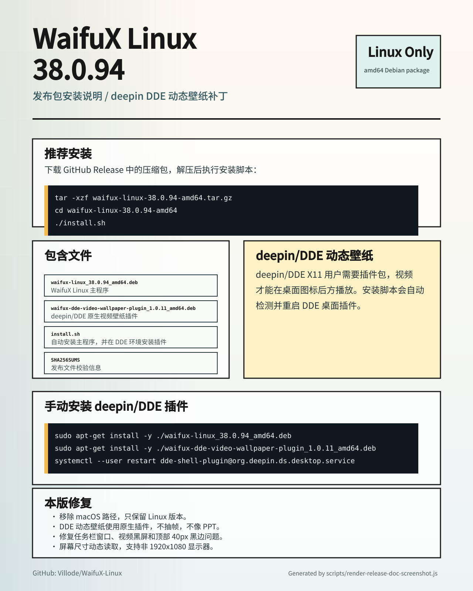

# WaifuX Linux v38.0.94 发布说明

## 安装包

推荐下载 GitHub Release 中的：

```text
waifux-linux-38.0.94-amd64.tar.gz
```

解压后执行：

```bash
tar -xzf waifux-linux-38.0.94-amd64.tar.gz
cd waifux-linux-38.0.94-amd64
./install.sh
```

## 包含内容

- `waifux-linux_38.0.94_amd64.deb`：WaifuX Linux 主程序。
- `waifux-dde-video-wallpaper-plugin_1.0.11_amd64.deb`：deepin/DDE X11 原生视频壁纸插件补丁包。
- `install.sh`：自动安装脚本。
- `README.txt`：离线安装说明。
- `SHA256SUMS`：文件校验信息。

## deepin/DDE 动态壁纸

deepin/DDE X11 用户需要安装插件包，才能让视频动态壁纸显示在桌面图标后方。`install.sh` 会自动检测 deepin/DDE 并安装插件。

手动安装：

```bash
sudo apt-get install -y ./waifux-linux_38.0.94_amd64.deb
sudo apt-get install -y ./waifux-dde-video-wallpaper-plugin_1.0.11_amd64.deb
systemctl --user restart dde-shell-plugin@org.deepin.ds.desktop.service
```

## 主要修复

- Linux-only 打包，移除 macOS 代码路径。
- deepin/DDE 视频动态壁纸使用原生 DDE 插件，不再抽帧，不再像 PPT。
- 修复 DDE 桌面窗口单独出现在任务栏/切换器的问题。
- 修复 deepin/DDE 上视频黑屏问题。
- 修复 DDE 桌面窗口被 KWin 顶部 frame 挤成 `1920x1040` 的问题，改为根据当前屏幕尺寸动态全屏。

## 说明文档截图


